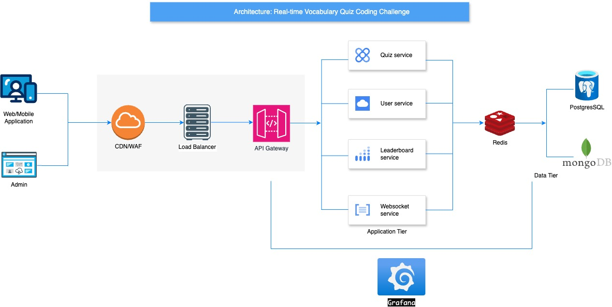

# Real-Time Vocabulary Quiz Design System

## System Design Document
### Architecture Diagram


**I have provided the SVG file in case you can't see the JPG file clearly.**

### Component Description
1. **Infrastructure & Security Layer**
Cloudflare provides CDN services, DDoS protection, and WAF functionality, ensuring content delivery and security at the edge. Load Balancers distribute traffic and handle SSL termination, maintaining high availability across the system.

2. **API Gateway Layer (Kong)**
Positioned as the central orchestrator, Kong manages internal service routing, API versioning, and request transformations. It facilitates service discovery and WebSocket proxying while maintaining unified API policies and analytics.

3. **Core Services**
- **Quiz Service**: Manages quiz lifecycle, question delivery, and scoring logic. Handles session state and ensures synchronized quiz progression across participants.
- **User Service**: Controls authentication, user profiles, and session management. Maintains user state and handles authorization across the platform.
- **Leaderboard Service**: Processes real-time rankings, manages score calculations, and maintains competitive standings.
- **WebSocket Service**: Facilitates real-time communication, broadcasting quiz events and updates to connected clients.

4. **Data Stores**
- **Redis**: Handles real-time data including active sessions, live rankings, and temporary cache.
- **PostgreSQL**: Stores persistent data such as user profiles, quiz history, and analytical data.
- **MongoDB**: Manages quiz content, question banks, and media assets with flexible schema support.

### Data Flow
1. **Quiz Participation Flow**
```
User → Cloudflare → Load Balancer → Kong → Quiz Service
↓
Redis (session storage)
↓
MongoDB (fetch questions)
↓
WebSocket Service (broadcast to participants)
```

2. **Answer Submission Flow**
```
User → WebSocket Service → Quiz Service
↓
Redis (update scores)
↓
Leaderboard Service (recalculate rankings)
↓
PostgreSQL (store history)
↓
WebSocket Service (broadcast updates)
```

3. **Leaderboard Update Flow**
```
Quiz Service → Redis (score update)
↓
Leaderboard Service (process rankings)
↓
Redis (cache new standings)
↓
WebSocket Service → All Participants
```

### Technology Justification
1. **Infrastructure Choices**
**Cloudflare**: Selected for global CDN coverage and robust security features
**Load Balancer**: Ensures high availability and efficient traffic distribution
**Kong**: Chosen for its powerful API management capabilities and plugin ecosystem

2. **Service Layer**
- FastAPI
  - High performance for real-time operations
  - Native async support
  - Built-in WebSocket capabilities
  - Automatic API documentation

3. **Database Selections**
- Redis
  - Ultra-fast in-memory operations
  - Built-in support for real-time rankings
  - Pub/Sub capabilities for live updates

- PostgreSQL
  - ACID compliance for critical data
  - Complex query capabilities
  - Robust transaction support

- MongoDB
  - Flexible schema for varied quiz content
  - Efficient document storage
  - Rich query capabilities

4. **Frontend Technologies**
- React/TypeScript
  - Strong type safety
  - Rich ecosystem
  - Component reusability
  - Efficient state management

5. **Real-time Communication**
- WebSocket
  - Full-duplex communication
  - Low latency for live quiz updates
  - Efficient broadcast capabilities
